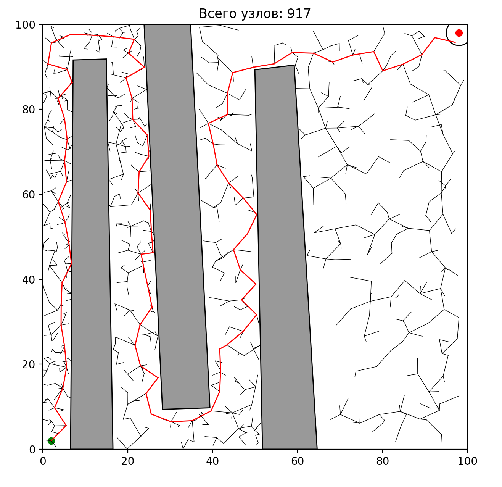

# Rapidly exploring Random Tree

### Usage
```commandline
python3 main.py -h
usage: main.py [-h] [-mn MAX_NODES] [-s STEP] [-p PRECISION] [-a] file

positional arguments:
  file                  JSON file

optional arguments:
  -h, --help            show this help message and exit
  -mn MAX_NODES, --max_nodes MAX_NODES
                        Максимальное число узлов в дереве
  -s STEP, --step STEP  Минимальный размер шага
  -p PRECISION, --precision PRECISION
                        Погрешность конечной вершины
  -a, --animated        Показать анимацию


```

### Example

Input

```commandline
python3 main.py --step 5 --precision 3 --max_nodes 2000 examples/labirinth.json
```

Result

